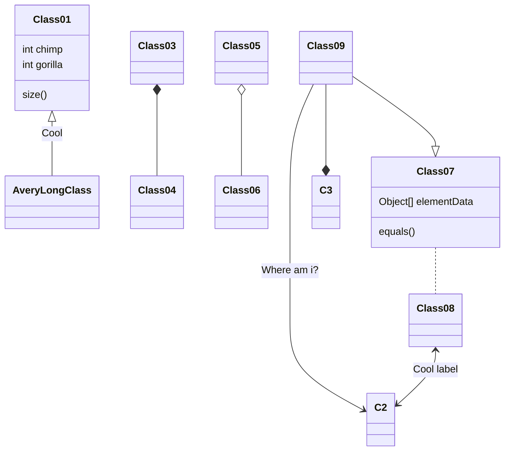

# Virginea carnes mulcere excutit




# [C#](#tab/tab1-0)
```cs
public void myFunction()
{
    document.getElementById("demo").innerHTML = "Paragraph changed.";
}
```
# [JS](#tab/tab1-1)
```js
function myFunction()
{
    document.getElementById("demo").innerHTML = "Paragraph changed.";
}
```
# [Lua](#tab/tab1-2)
```lua
local function myFunction()
    document.getElementById("demo").innerHTML = "Paragraph changed."
end
```
***

# [JS](#tab/tab1-1)
```js
function myFunction()
{
    document.getElementById("demo").innerHTML = "Paragraph changed.";
}
```
# [C#](#tab/tab1-0)
```cs
public void myFunction()
{
    document.getElementById("demo").innerHTML = "Paragraph changed.";
}
```
# [Lua](#tab/tab1-2)
```lua
local function myFunction()
    document.getElementById("demo").innerHTML = "Paragraph changed."
end
```
***

# [Lua](#tab/tab1-2)
```lua
local function myFunction()
    document.getElementById("demo").innerHTML = "Paragraph changed."
end
```
# [JS](#tab/tab1-1)
```js
function myFunction()
{
    document.getElementById("demo").innerHTML = "Paragraph changed.";
}
```
# [C#](#tab/tab1-0)
```cs
public void myFunction()
{
    document.getElementById("demo").innerHTML = "Paragraph changed.";
}
```
***

# [C#](#tab/tab2-0)
## Lorem ipsum dolor sit amet
```cs
public void myFunction()
{
    document.getElementById("demo").innerHTML = "Paragraph changed.";
}
```
# [JS](#tab/tab2-1)
```js
function myFunction()
{
    document.getElementById("demo").innerHTML = "Paragraph changed.";
}
```
# [Lua](#tab/tab2-2)
```lua
local function myFunction()
    document.getElementById("demo").innerHTML = "Paragraph changed."
end
```
***

# [Lorem](#tab/tab3-0)
Lorem
# [Ipsum](#tab/tab3-1)
Lorem ipsum
# [Dolor](#tab/tab3-2)
Lorem ipsum dolor
# [Sit](#tab/tab3-3)
Lorem ipsum dolor sit
# [Amet](#tab/tab3-4)
Lorem ipsum dolor sit amet
***
